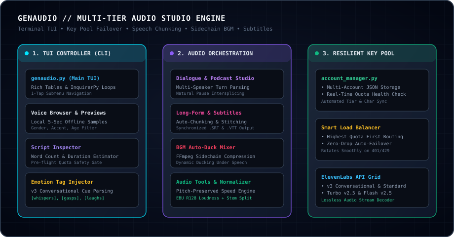
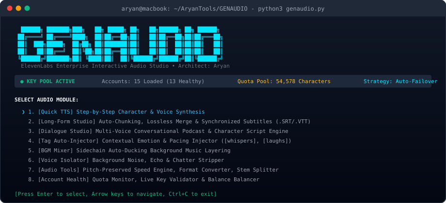
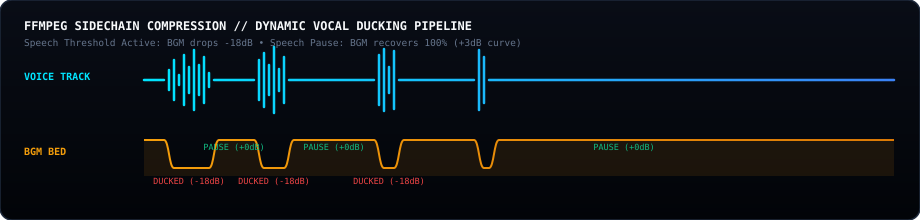

<div align="center">

# GENAUDIO

### ElevenLabs Enterprise Interactive Audio Studio &amp; Voice Engineering CLI

[](https://python.org)
[](https://ffmpeg.org)
[](https://elevenlabs.io)
[](LICENSE)
[-0A0A0A?style=flat-square&logo=github&logoColor=white)](https://github.com/thatonearyan-sh)

<br />


<br />

<p align="center">
  <b>GENAUDIO</b> is an open-source, enterprise-grade audio engineering CLI and interactive terminal studio built for <b>ElevenLabs</b> voice synthesis. Engineered with resilient multi-key pool balancing, automated long-form sentence chunking, dynamic subtitle generation, and FFmpeg sidechain background music ducking.
</p>

[System Architecture](#-system-architecture) &bull;
[Core Modules](#-core-audio-modules) &bull;
[The Terminal TUI](#-the-terminal-tui-interface) &bull;
[BGM Sidechain Ducking](#-sidechain-ducking--dsp-pipeline) &bull;
[Key Pool Architecture](#-resilient-key-pool--load-balancer) &bull;
[Installation &amp; Setup](#-installation--quickstart) &bull;
[Test Suite](#-automated-audit--test-suite)

---

</div>

## <svg width="20" height="20" viewBox="0 0 24 24" fill="none" stroke="#00E5FF" stroke-width="2" stroke-linecap="round" stroke-linejoin="round" style="vertical-align: -3px; margin-right: 8px;"><rect x="3" y="3" width="18" height="18" rx="2"/><path d="M3 9h18"/><path d="M9 21V9"/></svg> System Architecture

GENAUDIO decouples interactive terminal control, multi-key load balancing, speech chunking, and DSP audio processing across three modular tiers:

<div align="center">
  
</div>

---

## <svg width="20" height="20" viewBox="0 0 24 24" fill="none" stroke="#F59E0B" stroke-width="2" stroke-linecap="round" stroke-linejoin="round" style="vertical-align: -3px; margin-right: 8px;"><polygon points="13 2 3 14 12 14 11 22 21 10 12 10 13 2"/></svg> Core Audio Modules

<div>
  
</div>

<br />

### 1. Quick Text-to-Speech Wizard
- Instant synthesis supporting `v3 Conversational`, `v3 Standard`, `Multilingual v2`, `Turbo v2.5`, and `Flash v2.5`.
- Pre-flight token and duration calculations prevent character consumption surprises.

### 2. Long-Form Script Studio &amp; Subtitles
- Intelligent boundary splitting on punctuation and scene headers (`## Scene 1`).
- Lossless concatenation into a single Master MP3.
- Automatic synchronized `.SRT` and `.VTT` subtitle generation for video editors.

### 3. Multi-Voice Dialogue &amp; Podcast Studio
- Multi-speaker script parsing:
  ```markdown
  [Jessica]: Hey Adam, did you see the new audio pipeline?
  [Adam]: Yes, the sidechain ducking filter runs with zero artifacts.
  ```
- Assigns distinct ElevenLabs voices per character and stitches audio turns with natural inter-speech pauses.

### 4. AI Emotion &amp; Expression Tag Injector
- Analyzes plain text and injects v3 conversational pacing markers: `[whispers]`, `[gasps]`, `[excited]`, `[slowly]`, `[proud]`, `[sarcastically]`, `[laughs]`.

### 5. Sound Effects (SFX) Generator
- Text-to-SFX engine generating cinematic whooshes, ambient textures, and sci-fi audio assets.

### 6. Voice Isolator &amp; Vocal Cleaner
- Strips background room echo, microphone hum, and ambient chatter using ElevenLabs isolation endpoints.

### 7. Audio Tools &amp; Normalizer
- Pitch-preserved speed adjustment (`0.85x`, `1.15x`, `1.25x`, `1.50x`) using the `atempo` filter.
- Lossless exports to `.WAV`, `.FLAC`, `.M4A`, and `320k MP3`.
- EBU R128 loudness normalization and audio stem separation.

---

## <svg width="20" height="20" viewBox="0 0 24 24" fill="none" stroke="#10B981" stroke-width="2" stroke-linecap="round" stroke-linejoin="round" style="vertical-align: -3px; margin-right: 8px;"><path d="M4 17l6-6-6-6M12 19h8"/></svg> The Terminal TUI Interface

<div align="center">
  
</div>

---

## <svg width="20" height="20" viewBox="0 0 24 24" fill="none" stroke="#EC4899" stroke-width="2" stroke-linecap="round" stroke-linejoin="round" style="vertical-align: -3px; margin-right: 8px;"><path d="M2 10v3M6 6v11M10 3v18M14 8v7M18 5v13M22 10v3"/></svg> Sidechain Ducking &amp; DSP Pipeline

GENAUDIO embeds hardware FFmpeg sidechain compression filters. When speech audio begins, background music automatically drops by -18dB and seamlessly ramps back up (+0dB) during inter-speaker pauses:

<div align="center">
  
</div>

---

## <svg width="20" height="20" viewBox="0 0 24 24" fill="none" stroke="#8B5CF6" stroke-width="2" stroke-linecap="round" stroke-linejoin="round" style="vertical-align: -3px; margin-right: 8px;"><path d="M12 22s8-4 8-10V5l-8-3-8 3v7c0 6 8 10 8 10z"/></svg> Resilient Key Pool &amp; Load Balancer

<div>
  
</div>

<br />

GENAUDIO avoids single-key API bottlenecks by managing an active pool of accounts:

| Feature | Implementation | Benefit |
|:---|:---|:---|
| **Health Telemetry** | Real-time query to `/v1/user/subscription` | Instant visibility of depleted keys |
| **Load Balancing** | `highest_quota_first` algorithm | Distributes load to keys with maximum headroom |
| **Zero-Drop Failover**| Catches HTTP 401 &amp; 429 quota exceptions | Automatically rotates to next active key mid-synthesis |

---

## <svg width="20" height="20" viewBox="0 0 24 24" fill="none" stroke="#00E5FF" stroke-width="2" stroke-linecap="round" stroke-linejoin="round" style="vertical-align: -3px; margin-right: 8px;"><path d="M14.7 6.3a1 1 0 0 0 0 1.4l1.6 1.6a1 1 0 0 0 1.4 0l3.77-3.77a6 6 0 0 1-7.94 7.94l-6.91 6.91a2.12 2.12 0 0 1-3-3l6.91-6.91a6 6 0 0 1 7.94-7.94l-3.76 3.76z"/></svg> Installation &amp; Quickstart

### 1. Prerequisites
- Python 3.10+
- FFmpeg (required for audio stitching, speed alteration and BGM ducking)
  ```bash
  # macOS (Homebrew)
  brew install ffmpeg

  # Ubuntu / Debian
  sudo apt-get install ffmpeg
  ```

### 2. Clone &amp; Install Dependencies
```bash
git clone https://github.com/thatonearyan-sh/GENAUDIO.git
cd GENAUDIO
pip install -r requirements.txt
```

### 3. Configure API Credentials
Copy the example pool configuration:
```bash
cp accounts.example.json accounts.json
```
Edit `accounts.json` and insert your ElevenLabs API keys:
```json
{
  "accounts": [
    {
      "id": 1,
      "name": "Primary Key",
      "api_key": "sk_your_elevenlabs_api_key_here",
      "status": "active",
      "tier": "free",
      "character_limit": 10000,
      "character_count": 0,
      "character_remaining": 10000,
      "last_checked": "2026-08-01T12:00:00.000000"
    }
  ]
}
```

### 4. Launch Studio
```bash
python3 genaudio.py
```

---

## <svg width="20" height="20" viewBox="0 0 24 24" fill="none" stroke="#F59E0B" stroke-width="2" stroke-linecap="round" stroke-linejoin="round" style="vertical-align: -3px; margin-right: 8px;"><path d="M22 11.08V12a10 10 0 1 1-5.93-9.14"/><polyline points="22 4 12 14.01 9 11.01"/></svg> Automated Audit &amp; Test Suite

GENAUDIO includes an automated end-to-end verification suite covering all core modules:

```bash
python3 tests/test_genaudio.py
```

```
Ran 10 tests in 21.976s

OK
  [Audit 1 Passed] Accounts Loaded & Quota Verified
  [Audit 2 Passed] Voice Library & 5-Sec Offline Sample Verified
  [Audit 3 Passed] Script Inspector Duration Calculator Verified
  [Audit 4 Passed] Tag Injector Contextual Markers Verified
  [Audit 5 Passed] TTS Synthesis & Decoding Verified
  [Audit 6 Passed] Long-Form Chunking & Synchronized .SRT Verified
  [Audit 7 Passed] Multi-Voice Dialogue Studio Verified
  [Audit 8 Passed] Audio Speed Engine & Lossless WAV Converter Verified
  [Audit 9 Passed] BGM Auto-Duck Mixer (FFmpeg Sidechain) Verified
  [Audit 10 Passed] Project History Logging & Integrity Verified
```

---

## <svg width="20" height="20" viewBox="0 0 24 24" fill="none" stroke="#00E5FF" stroke-width="2" stroke-linecap="round" stroke-linejoin="round" style="vertical-align: -3px; margin-right: 8px;"><path d="M20 21v-2a4 4 0 0 0-4-4H8a4 4 0 0 0-4 4v2"/><circle cx="12" cy="7" r="4"/></svg> Architect &amp; License

Developed by **Aryan**  
- **GitHub**: [@thatonearyan-sh](https://github.com/thatonearyan-sh)  
- **Email**: `thatonearyan@gmail.com`  

*Released under the [MIT License](LICENSE).*
